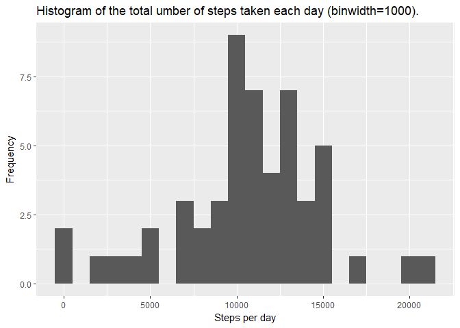
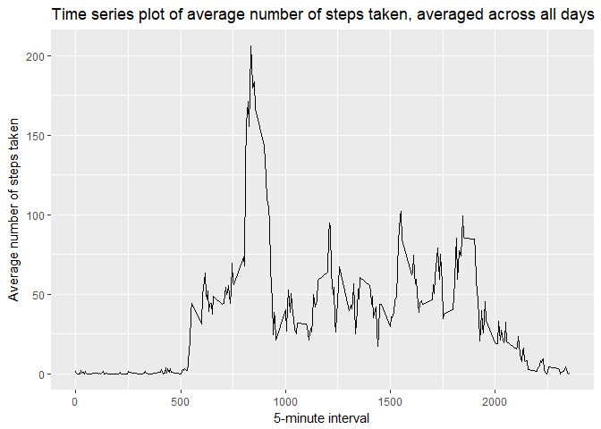
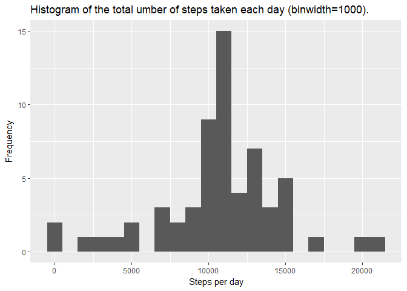
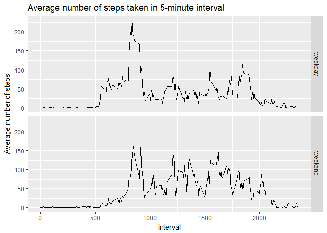

# Reproducible Research: Peer Assessment 1
Igor Kozina  


##Introduction

It is now possible to collect a large amount of data about personal movement using activity monitoring devices such as a Fitbit, Nike Fuelband, or Jawbone Up. These type of devices are part of the "quantified self" movement - a group of enthusiasts who take measurements about themselves regularly to improve their health, to find patterns in their behavior, or because they are tech geeks. But these data remain under-utilized both because the raw data are hard to obtain and there is a lack of statistical methods and software for processing and interpreting the data.

This assignment makes use of data from a personal activity monitoring device. This device collects data at 5 minute intervals through out the day. The data consists of two months of data from an anonymous individual collected during the months of October and November, 2012 and include the number of steps taken in 5 minute intervals each day.

## Loading and preprocessing the data

####1. Load the data (i.e. read.csv())

```r
library(ggplot2)
activity <- read.csv("activity.csv", header = TRUE, sep=",", na.strings = "NA", colClasses = c("integer", "character", "integer"))
```

####2. Process/transform the data (if necessary) into a format suitable for your analysis
Add additional column ddate that will hold date in POSIXlt format.

```r
activity$ddate <- strptime(activity$date, "%Y-%m-%d")
```

## What is mean total number of steps taken per day?

####1. Calculate the total number of steps taken per day and make a histogram of the total number of steps taken each day.

```r
steps_per_day <- aggregate(steps ~ date, data = activity, FUN = sum)
names(steps_per_day) <- c('date', 'ttl_steps')

ggplot(steps_per_day, aes(x=ttl_steps)) + geom_histogram(binwidth = 1000) + labs(title = "Histogram of the total umber of steps taken each day (binwidth=1000).", x = "Steps per day", y = "Frequency")
```

<!-- -->

####2. Calculate and report the mean and median of the total number of steps taken per day.

```r
steps_mean <- mean(steps_per_day$ttl_steps, na.rm = TRUE)
steps_median <- median(steps_per_day$ttl_steps, na.rm = TRUE)
```

#####Total number of steps taken per day
* Mean: 1.0766189\times 10^{4}
* Median: 10765

## What is the average daily activity pattern?

####1. Make a time series plot (i.e. type = "l") of the 5-minute interval (x-axis) and the average number of steps taken, averaged across all days (y-axis)

```r
steps_per_interval <- aggregate(steps ~ interval, data = activity, FUN = mean, na.rm = TRUE)
names(steps_per_interval) <- c('interval', 'avg_steps')

ggplot(steps_per_interval, aes(x=interval, y=avg_steps)) + geom_line() + labs(title = "Time series plot of average number of steps taken, averaged across all days", x = "5-minute interval", y = "Average number of steps taken")
```

<!-- -->

####2. Which 5-minute interval, on average across all the days in the dataset, contains the maximum number of steps?

```r
max_steps <- steps_per_interval$avg_steps[which.max(steps_per_interval$avg_steps)]
max_steps_interval <- steps_per_interval$interval[which.max(steps_per_interval$avg_steps)]
```
Interval 835 has maximum number of steps: 206.1698113.

## Imputing missing values

####1. Calculate and report the total number of missing values in the dataset (i.e. the total number of rows with NAs)

```r
total_missing_values <- sum(is.na(activity$steps))
```
Total number of missing values: 2304

####2. Devise a strategy for filling in all of the missing values in the dataset. The strategy does not need to be sophisticated. For example, you could use the mean/median for that day, or the mean for that 5-minute interval, etc.

We will replace missing values with average number of steps in the same 5-minute interval.

```r
steps_per_interval2 <- tapply(activity$steps, activity$interval, FUN = mean, na.rm = TRUE, simplify = TRUE)
```

####3. Create a new dataset that is equal to the original dataset but with the missing data filled in.

```r
activity2 <- activity
NAs_boolean <- is.na(activity2$steps)
activity2$steps[NAs_boolean] <- steps_per_interval2[as.character(activity2$interval[NAs_boolean])]
```

####4. Make a histogram of the total number of steps taken each day and Calculate and report the mean and median total number of steps taken per day. Do these values differ from the estimates from the first part of the assignment? What is the impact of imputing missing data on the estimates of the total daily number of steps?

```r
steps_per_day2 <- aggregate(steps ~ date, data = activity2, FUN = sum)
names(steps_per_day2) <- c('date', 'ttl_steps')

ggplot(steps_per_day2, aes(x=ttl_steps)) + geom_histogram(binwidth = 1000) + labs(title = "Histogram of the total umber of steps taken each day (binwidth=1000).", x = "Steps per day", y = "Frequency")
```

<!-- -->


```r
steps_mean2 <- mean(steps_per_day2$ttl_steps, na.rm = TRUE)
steps_median2 <- median(steps_per_day2$ttl_steps, na.rm = TRUE)
```

#####Total number of steps taken per day
* Mean: 1.0766189\times 10^{4}
* Median: 1.0766189\times 10^{4}

Replacing missing values with average number of steps in the same 5-minute interval influences histogram and median, but mean stays the same.

## Are there differences in activity patterns between weekdays and weekends?

####1. Create a new factor variable in the dataset with two levels - "weekday" and "weekend" indicating whether a given date is a weekday or weekend day.

```r
activity2$weektype <- as.factor(ifelse(weekdays(activity2$ddate) %in% c("Saturday", "Sunday"), "weekend", "weekday"))
```

####2. Make a panel plot containing a time series plot (i.e. type = "l") of the 5-minute interval (x-axis) and the average number of steps taken, averaged across all weekday days or weekend days (y-axis). See the README file in the GitHub repository to see an example of what this plot should look like using simulated data.

```r
steps_per_weektype_interval <- aggregate(steps ~ interval + weektype, data = activity2, FUN = mean)
ggplot(steps_per_weektype_interval, aes(x=interval, y=steps)) + geom_line() + facet_grid(weektype ~ .) + labs(title = "Average number of steps taken in 5-minute interval", x = "interval", y = "Average number of steps")
```

<!-- -->
